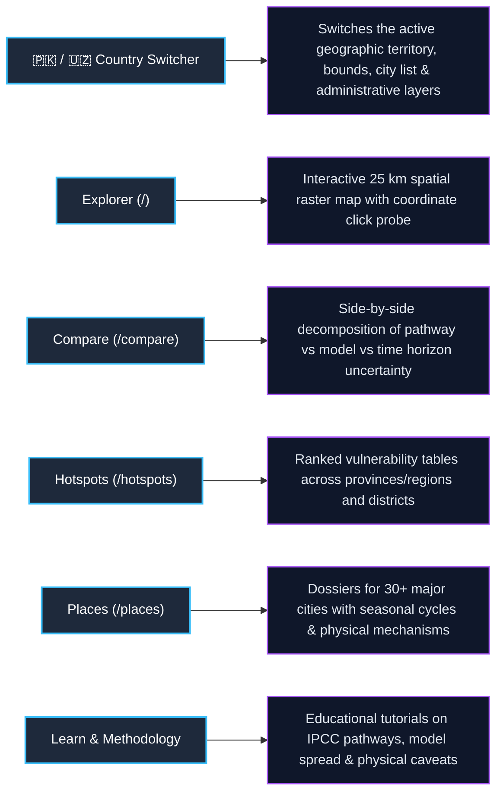
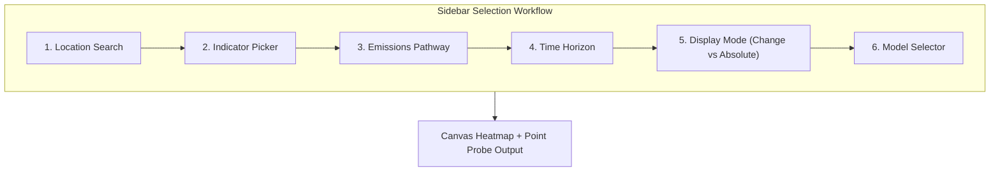

# Climate Intelligence Platform: Visual User & Feature Reference Guide

> **Audience:** Product Managers, Developers, Policy Analysts, Stakeholders & End-Users  
> **Scope:** Complete visual breakdown of every screen, button, dropdown, slider, and scientific metric across **Pakistan 🇵🇰** and **Uzbekistan 🇺🇿**.

---

## 1. Global Navigation & Country Switcher

The top navigation header remains accessible across every view.

```
+---------------------------------------------------------------------------------------------------------------+
|  (ESS) EARTH SCAN SYSTEMS | Climate Uzbekistan   [ 🇵🇰 Pakistan | 🇺🇿 Uzbekistan ]                              |
|  [ Explorer ]   [ Compare ]   [ Hotspots ]   [ Places ]   [ Learn ]   [ Methodology ]   (CMIP6 · CCKP 0.25°)  |
+---------------------------------------------------------------------------------------------------------------+
```

### Navigation Controls & Meanings



| Element | Location | What It Does | Why It Matters |
| :--- | :--- | :--- | :--- |
| **Country Selector Pills** | Top Header (Center) | Toggles between **Pakistan** and **Uzbekistan**. | Instantly re-centers the map, loads local administrative boundaries (provinces/regions/districts), and filters place registries. |
| **Explorer** | Header Nav | Navigates to `/` (Main Map). | The primary spatial exploration workbench. |
| **Compare** | Header Nav | Navigates to `/compare`. | Deconstructs where uncertainty comes from (policy vs physics vs time). |
| **Hotspots** | Header Nav | Navigates to `/hotspots`. | Identifies which districts warm fastest or face severe moisture deficits. |
| **Places** | Header Nav | Navigates to `/places`. | City-by-city directory organized by ecological settings (coastal, desert, oasis, glacial mountain). |
| **CMIP6 Badge** | Header Right | Informational tag. | Verifies data provenance directly from the World Bank 0.25° CMIP6 archive. |

---

## 2. Interactive Geospatial Explorer (`/`)

The **Explorer** is the core interactive spatial interface.

```
+---------------------------------------------------------------------------------------------------------------+
| SIDEBAR CONTROLS                 | MAP CANVAS & DISPLAY                                                       |
|                                  | +------------------------------------------------------------------------+ |
| [ Search City or Coord...      ] | | HEADLINE: Mean Temperature — change by 2040–2059                       | |
|                                  | | ● SSP2-4.5 (Middle pathway) · Ensemble median · CMIP6 0.25°             | |
| INDICATOR                        | +------------------------------------------------------------------------+ |
| (•) Mean Temperature (tas)       |                                                                            |
| ( ) Hot Days >35°C (hd35)        |                   /\  [Tian Shan / Karakoram Glaciers]                     |
| ( ) Precipitation (pr)           |                  /  \                                                      |
| ( ) Consecutive Dry Days (cdd)   |                 /    \   [Fergana / Indus Agricultural Plains]             |
|                                  |                /      \                                                    |
| EMISSIONS PATHWAY (SSP)          |       [Aral /  \                                                           |
| [ SSP2-4.5 (Middle of Road)  v ] |        Kyzylkum \                                                          |
|                                  |        Desert]   \                                                         |
| TIME HORIZON                     |                   \  [Southern Oasis / Coastline]                          |
| [ 2040–2059 (Mid-Century)    v ] |                                                                            |
|                                  | +------------------------------------------------------------------------+ |
| DISPLAY MODE                     | | POINT PROBE (SLIDE-OUT PANEL)                                          | |
| [ Change (Anomaly) | Absolute  ] | | Selected: Tashkent (41.30°N, 69.24°E)                                  | |
|                                  | | Baseline (1995-2014): 14.8 °C                                          | |
| MODEL CHOICE                     | | Projected (2050s):    16.6 °C                                          | |
| [ Ensemble Median (30 GCMs)  v ] | | Projected Anomaly:    +1.8 °C (80% spread: +1.2°C to +2.4°C)            | |
|                                  | | [ 12-Month Seasonal Cycle Chart ]  [ View Complete City Story -> ]     | |
| REGION FILTER                    | +------------------------------------------------------------------------+ |
| [ All ] [ Tashkent ] [ Samarkand]| MAP LEGEND:                                                                |
| [ [X] Show District Borders    ] | [ +0.5 °C ] ============== [ +2.0 °C ] ============== [ +4.5 °C ]          |
+----------------------------------+----------------------------------------------------------------------------+
```

### Every Sidebar Control Explained



1. **Location Search Box:**
   - **How to use:** Type any city name (e.g., *Lahore*, *Karachi*, *Tashkent*, *Samarkand*, *Bukhara*, *Gilgit*) or paste a decimal latitude/longitude coordinate.
   - **What it does:** Drops a selection pin, pans the map, and opens the detailed point inspection panel.

2. **Indicator Dropdown / Picker:**
   - **What it does:** Selects the climate variable rendered across the country's $0.25^\circ$ lattice.
   - **Key Options:**
     - `tas` *(Mean Temperature)*: Near-surface air temperature in $^\circ\text{C}$.
     - `tasmax` *(Maximum Temperature)*: Daytime peak temperature.
     - `hd35` / `hd40` *(Hot Days)*: Annual count of days exceeding $35^\circ\text{C}$ or $40^\circ\text{C}$.
     - `pr` *(Precipitation)*: Total rainfall in $\text{mm}$ (or $\%$ change).
     - `rx5day` *(Wettest 5 Days)*: Maximum 5-consecutive-day rainfall total (classic riverine flood proxy).
     - `cdd` *(Consecutive Dry Days)*: Longest drought run with $<1\text{ mm}$ rain.
     - `cdd65` *(Cooling Degree Days)*: Air-conditioning demand proxy in $^\circ\text{F-days}$.

3. **Emissions Pathway (SSP) Dropdown:**
   - **What it does:** Selects the global greenhouse gas trajectory based on the IPCC AR6 definitions:
     - `SSP1-1.9`: Very aggressive climate action (limits global warming near $1.5^\circ\text{C}$).
     - `SSP1-2.6`: Paris Agreement target (keeps warming below $2.0^\circ\text{C}$).
     - `SSP2-4.5`: Middle-of-the-road / current policy trajectory.
     - `SSP3-7.0`: Regional rivalry / high emissions with weak international cooperation.
     - `SSP5-8.5`: Unmitigated fossil-fuel intensive development.

4. **Time Horizon (Epoch) Selector:**
   - **What it does:** Toggles between 20-year climatological windows:
     - `1995–2014`: Historical baseline reference period.
     - `2020–2039`: Near-future (current trajectory).
     - `2040–2059`: Mid-century (planning horizon for long-term infrastructure).
     - `2060–2079`: Late-century.
     - `2080–2099`: End-of-century.

5. **Display Mode Toggle (Change vs. Absolute):**
   - `Change (Anomaly)`: Shows the difference $(\Delta)$ between the future epoch and the 1995–2014 baseline (e.g., $+1.8^\circ\text{C}$ or $+15\%$ rain).
   - `Absolute`: Shows the raw projected climatological value itself (e.g., $32.4^\circ\text{C}$ or $450\text{ mm}$).

6. **Model Selector:**
   - `Ensemble Median (Default)`: The robust multi-model consensus across all 30 Global Climate Models.
   - `Individual Models`: View specific GCM simulations (e.g., *EC-Earth3*, *GFDL-ESM4*, *MPI-ESM1-2-HR*, *CanESM5*).

7. **Region Filter Chips & District Toggle:**
   - **Region Chips:** Click any province (e.g., *Sindh*, *Punjab*) or region (e.g., *Karakalpakstan*, *Tashkent*) to mask the map and zoom to that administrative boundary.
   - **Show District Boundaries Checkbox:** Toggles granular Level-2 district border vectors on the SVG overlay.

---

## 3. Multi-Scenario & Model Comparison (`/compare`)

The **Compare** workspace separates the three fundamental sources of climate uncertainty.

```
+---------------------------------------------------------------------------------------------------------------+
|  COMPARE — DECOMPOSING CLIMATE UNCERTAINTY                                                                     |
|  Location: [ Tashkent (Tashkent City) v ]   Indicator: [ Mean Temperature v ]   Horizon: [ 2040-2059 v ]       |
+---------------------------------------------------------------------------------------------------------------+
|  [1] SCENARIO DIVERGENCE (WHICH POLICY PATHWAY?)                                                              |
|                                                                                                               |
|  SSP1-1.9 (Paris 1.5°C)  |  +0.9 °C  [====]                                                                   |
|  SSP1-2.6 (Low Emissions)|  +1.2 °C  [======]                                                                 |
|  SSP2-4.5 (Current Path) |  +1.8 °C  [=========]                                                              |
|  SSP3-7.0 (High)         |  +2.4 °C  [============]                                                           |
|  SSP5-8.5 (Very High)    |  +2.9 °C  [===============]                                                        |
|                                                                                                               |
|  Policy Divergence Gap: 1.7 °C gap between aggressive mitigation (SSP1-2.6) and unmitigated emissions.       |
+---------------------------------------------------------------------------------------------------------------+
|  [2] MODEL SPREAD (SCIENTIFIC UNCERTAINTY)                                                                    |
|  Ensemble Spread under SSP2-4.5:                                                                              |
|  p10 (Lower Bound): +1.2 °C | Median (Central): +1.8 °C | p90 (Upper Bound): +2.4 °C                          |
|  [----|=====================*======================|----]                                                     |
|  Agreement: Strong consensus (100% of models indicate warming).                                               |
+---------------------------------------------------------------------------------------------------------------+
|  [3] 1950–2100 NATIONAL TRAJECTORY                                                                            |
|  Continuous multi-scenario ribbon showing historical observations transitioning into projected pathways.     |
+---------------------------------------------------------------------------------------------------------------+
```

### What Each Section Tells You:
1. **Scenario Divergence:** Highlights the difference that human climate policy makes. Near-term warming (2030s) is mostly locked in; by 2070, the gap between low and high pathways widens dramatically.
2. **Model Spread:** Quantifies whether scientific models agree on the magnitude and direction of change.
3. **Continuous Trajectory:** Stitches 1950–2014 historical observations with 2015–2100 projections to visualize the multi-decade curve.

---

## 4. District Vulnerability Hotspots & Rankings (`/hotspots`)

The **Hotspots** view ranks all administrative units in the selected country by climate hazard severity.

```
+---------------------------------------------------------------------------------------------------------------+
|  HOTSPOTS — UZBEKISTAN                                                                                        |
|  Pathway: [ SSP3-7.0 v ]   Indicator: [ Very Hot Days >40°C v ]   Horizon: [ 2060-2079 v ]   Level: [ Regions ]|
+----+-----------------------------+-------------------+-----------------+------------------+-------------------+
| #  | Region / District           | Country           | Baseline        | Projected Change | Model Agreement   |
+----+-----------------------------+-------------------+-----------------+------------------+-------------------+
| 1  | Surxondaryo Region (Termez) | Uzbekistan        | 32.4 days       | +26.8 days       | 100% (High)       |
| 2  | Qashqadaryo Region (Qarshi) | Uzbekistan        | 24.1 days       | +24.2 days       | 100% (High)       |
| 3  | Bukhara Region              | Uzbekistan        | 21.8 days       | +22.5 days       | 100% (High)       |
| 4  | Republic of Karakalpakstan  | Uzbekistan        | 16.5 days       | +21.9 days       | 100% (High)       |
| 5  | Navoiy Region (Kyzylkum)    | Uzbekistan        | 19.2 days       | +20.4 days       | 100% (High)       |
+----+-----------------------------+-------------------+-----------------+------------------+-------------------+
```

### How to Use Hotspots:
* **Filter by Level:** Toggle between **Provinces / Regions (Level 1)** and **Districts (Level 2)**.
* **Sort by Hazard:** Change the indicator to find which areas experience the biggest jump in heatwaves (`hd40`), monsoon intensity (`rx5day`), or dry spells (`cdd`).
* **Visual Anomaly Bar:** The colored bar represents the relative magnitude of change compared to the most severely impacted district in the country.

---

## 5. Local Settlement Deep Dives (`/places/[id]`)

The **Places** page provides comprehensive climate dossiers for individual cities and ecological zones.

```
+---------------------------------------------------------------------------------------------------------------+
|  TASHKENT, UZBEKISTAN — CLIMATE DOSSIER                                                                       |
|  Elevation: 455m | Setting: Foothill & Mountain Gateway | Population: 3,000,000                               |
+---------------------------------------------------------------------------------------------------------------+
|  [1] 12-MONTH SEASONAL CLIMATOLOGY CYCLE                                                                      |
|      Precipitation (mm)                                                                                       |
|  80 |          __ Baseline (1995-2014)                                                                        |
|  60 |         /  \                                                                                            |
|  40 |  ______/    \__ Projected (2040-2059)                                                                   |
|  20 | /              \______                                                                                  |
|   0 +--+--+--+--+--+--+--+--+--+--+--+--+                                                                     |
|        J  F  M  A  M  J  J  A  S  O  N  D                                                                     |
|  Takeaway: Winter/spring precipitation shifts earlier; summer drought stress intensifies.                     |
+---------------------------------------------------------------------------------------------------------------+
|  [2] PHYSICAL MECHANISMS (NOT SPECULATIVE IMPACT CLAIMS)                                                      |
|  • Aral Sea Desiccation & Dust Storms: Intensified evaporative demand accelerates salt-dust mobilization.     |
|  • Tien Shan Glacial Runoff: Peak spring discharge shifts earlier, creating summer irrigation deficits.       |
|  • Continental Heatwaves: Urban canopy temperatures increase air-conditioning electricity demand.             |
+---------------------------------------------------------------------------------------------------------------+
|  [3] OPERATIONAL WEATHER NOWCAST (OPEN-METEO API)                                                             |
|  Real-time Weather: 26.4 °C | Humidity: 42% | Wind: 3.2 m/s | 7-Day Forecast: Mild conditions, clear skies     |
+---------------------------------------------------------------------------------------------------------------+
```

---

## 6. Summary of Scientific Rules & Metric Interpretations

| Indicator Code | Plain-Language Meaning | Unit | Interpretation Guide |
| :--- | :--- | :--- | :--- |
| `tas` | **Mean Temperature** | $^\circ\text{C}$ | Overall shift in average climate. $+1.5^\circ\text{C}$ to $+3.0^\circ\text{C}$ shifts ecological zones by hundreds of kilometers. |
| `tasmax` | **Maximum Daily Temperature** | $^\circ\text{C}$ | Peak daytime temperatures during summer months. |
| `hd35` / `hd40` | **Extreme Heat Days** | $\text{days/year}$ | Count of days exceeding $35^\circ\text{C}$ or $40^\circ\text{C}$. Critical for human survivability and outdoor labor. |
| `pr` | **Total Precipitation** | $\text{mm}$ or $\%$ | Total volume of rainfall/snowfall. Does not describe burst intensity. |
| `rx1day` / `rx5day`| **Extreme Rainfall Maxima** | $\text{mm}$ | Largest 1-day and 5-day downpours. Direct proxy for flash flooding and river overflows. |
| `cdd` | **Consecutive Dry Days** | $\text{days}$ | Longest run of days without rain. Primary metric for agricultural drought risk. |
| `cdd65` | **Cooling Degree Days** | $^\circ\text{F-days}$ | Direct proxy for air conditioning electricity load and power grid stress. |

---

*This guide provides complete operational, visual, and scientific clarity for all features of the Climate Intelligence Platform.*
